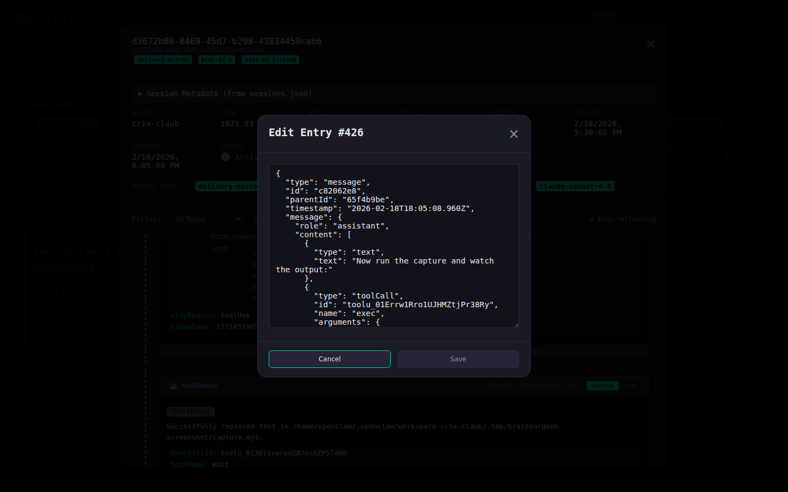

# BrainSurgeon 🧠

*OpenClaw extension for surgical session management.*

**Author:** anderslaub + friends

A web UI to browse, view, edit, prune, and delete OpenClaw agent sessions.


---

## What is This?

Your OpenClaw agents have been busy. They've had thousands of conversations, generated terabytes of output, and somewhere in there is that one brilliant insight you need to find again.

**BrainSurgeon is your operating theater.**

Browse sessions like flipping through patient charts. Prune bloated tool outputs. Delete the experiments that didn't pan out. Edit those embarrassing 3am prompts. Your agents' memories are now yours to shape.

---

## Features

| Feature | Description |
|---------|-------------|
| 🔍 **X-Ray Vision** | Browse sessions with full metadata: tokens, models, duration, channels |
| ✂️ **Neural Pruning** | Strip massive tool outputs while keeping conversation context |
| 🗑️ **Organ Harvesting** | Delete with trash recovery and optional autopsy reports |
| ✏️ **Neuroplasticity** | Edit individual messages—rewrite history if you must |
| 📊 **Vital Signs** | Token usage analytics, model breakdowns, duration tracking |
| 🔄 **Resurrection** | Restore sessions from trash (we don't judge) |


### Demo


---

## Quick Start

### Prerequisites

- OpenClaw installed and running
- Docker (recommended) or Python 3.12+
- Access to your OpenClaw data directory (usually `~/.openclaw`)

### Install as OpenClaw Extension

```bash
# Clone the repository
git clone https://github.com/clawdi-claub/brainsurgeon.git
cd brainsurgeon

# Link to OpenClaw extensions directory
ln -s "$(pwd)" ~/.openclaw/extensions/brainsurgeon
```

### Option 1: Run with Docker (Recommended)

```bash
# Build and start
docker-compose up --build -d

# Or rebuild without cache when updating
docker-compose build --no-cache
docker-compose up -d

# View logs
docker-compose logs -f
```

The UI will be available at `http://localhost:8654`

### Option 2: Run with Python

```bash
# Install dependencies
pip install fastapi uvicorn pydantic

# Run the API
python -m uvicorn api.main:app --host 0.0.0.0 --port 8654
```

### Option 3: For AI Agents

If you are an AI assistant installing this for a human:

```bash
# Clone and prepare
git clone https://github.com/clawdi-claub/brainsurgeon.git ~/.openclaw/extensions/brainsurgeon
cd ~/.openclaw/extensions/brainsurgeon

# Deploy with Docker
exec:docker-compose up --build -d

# Verify installation
exec:curl http://localhost:8654/agents
```

---

## Configuration

### API Server

| Variable | Default | Description |
|----------|---------|-------------|
| `OPENCLAW_ROOT` | `~/.openclaw` | Path to your OpenClaw data directory |
| `PORT` | `8654` | Port to run the API server |

### Nginx (Reverse Proxy)

When using nginx as a reverse proxy, copy `nginx.conf.template` to `nginx.conf` and set these environment variables:

| Variable | Default | Description |
|----------|---------|-------------|
| `NGINX_SERVER_NAME` | `localhost` | Server name for nginx (your domain) |
| `SSL_CERT_PATH` | `/etc/nginx/certs/fullchain.pem` | Path to SSL certificate |
| `SSL_KEY_PATH` | `/etc/nginx/certs/privkey.pem` | Path to SSL private key |
| `API_HOST` | `127.0.0.1` | Host where BrainSurgeon API runs |
| `API_PORT` | `8654` | Port where BrainSurgeon API runs |

Generate the config with envsubst:
```bash
export NGINX_SERVER_NAME=your-domain.com
export SSL_CERT_PATH=/path/to/cert.pem
export SSL_KEY_PATH=/path/to/key.pem
envsubst '
  ${NGINX_SERVER_NAME}
  ${SSL_CERT_PATH}
  ${SSL_KEY_PATH}
  ${API_HOST}
  ${API_PORT}
' < nginx.conf.template > nginx.conf
```

---

## Usage

Once running, open your browser to `http://localhost:8654`

### Session Browser
1. Select an agent from the dropdown
2. Sessions are sorted by most recent activity
3. Click any session to open the detail view


### Session Detail View
- View all messages in parsed, readable format
- See metadata: tokens, model, duration, channel
- Click "Edit" to modify individual entries
- Click "Prune" to strip tool outputs
- Click "Delete" to send to trash




### Pruning
Pruning removes tool output content (keeps the calls). This dramatically reduces file size while preserving conversation flow. Use it when sessions get bloated from large tool responses.

### Deleting
Deletion moves sessions to trash and removes them from OpenClaw's index. Sessions stay in trash for 14 days before permanent deletion. Use "Restore" to recover them.

---

## Project Structure

```
brainsurgeon/
├── api/
│   └── main.py            # FastAPI backend
├── web/
│   ├── index.html         # Frontend UI
│   └── app.js             # Frontend logic
├── docs/
│   └── screenshots/       # Documentation images
├── extension.yaml         # OpenClaw extension manifest
├── Dockerfile
├── docker-compose.yml
└── README.md
```

---

## API Endpoints

- `GET /agents` - List all agents
- `GET /sessions/{agent}` - List sessions for an agent
- `GET /sessions/{agent}/{session_id}` - Get session details
- `POST /sessions/{agent}/{session_id}/edit` - Edit session entry
- `POST /sessions/{agent}/{session_id}/prune` - Prune tool outputs
- `DELETE /sessions/{agent}/{session_id}` - Delete session
- `POST /sessions/{agent}/{session_id}/restore` - Restore from trash
- `GET /trash` - List trashed sessions
- `DELETE /trash/{filename}` - Permanently delete from trash

---

## Safety First

- **Backup recommended**: BrainSurgeon modifies session files. Consider backing up your `~/.openclaw/agents/` directory before major operations.
- **Undo available**: Deleted sessions go to trash and can be restored within 14 days.
- **Edit carefully**: Editing modifies the underlying JSONL files directly.

---

## Development

```bash
# Run in development mode with auto-reload
python -m uvicorn api.main:app --reload --port 8654
```

---

## Troubleshooting

**Sessions not showing up?**
- Check that `OPENCLAW_ROOT` points to your actual OpenClaw directory
- Verify the agents directory exists: `$OPENCLAW_ROOT/agents/`

**Permission denied when editing/deleting?**
- Ensure BrainSurgeon has write access to your OpenClaw directory
- When using Docker, the volume mount needs proper permissions

**UI not loading?**
- Check that the API is running: `curl http://localhost:8654/agents`
- Verify the port isn't already in use: `lsof -i :8654`

---

## GitHub Pages

Visit the landing page: https://clawdi-claub.github.io/brainsurgeon/

---

## License

MIT — Do what you want, but don't blame us if you accidentally delete something important.

*"With great power comes great ability to accidentally delete things permanently."*

---

## Contributing

Issues and pull requests welcome. This is a community tool for managing OpenClaw sessions.

Built with 🧠 by anderslaub + friends
