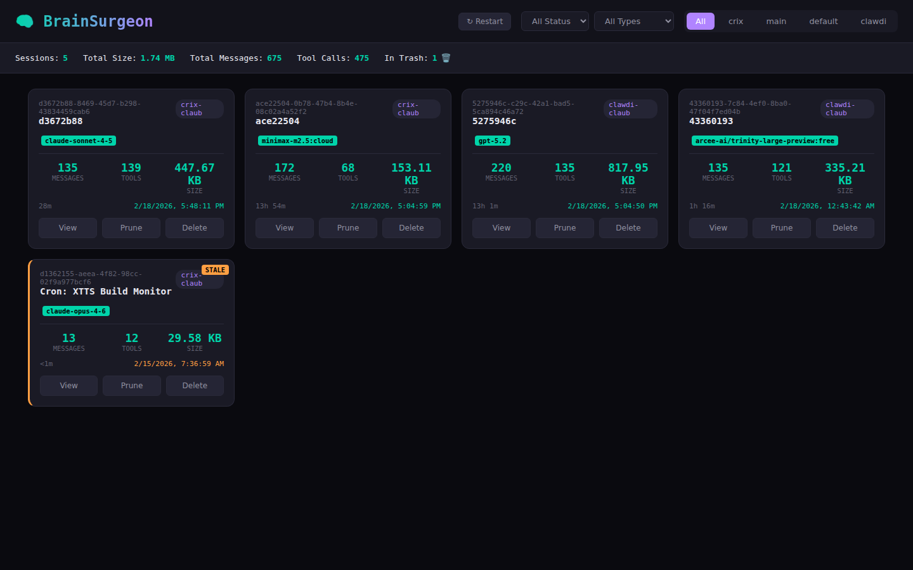
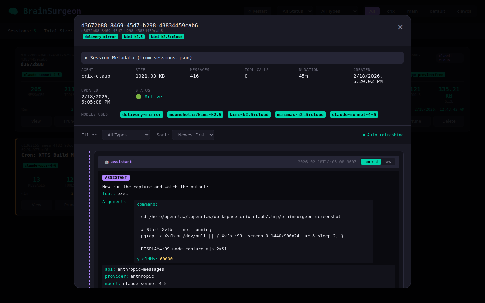
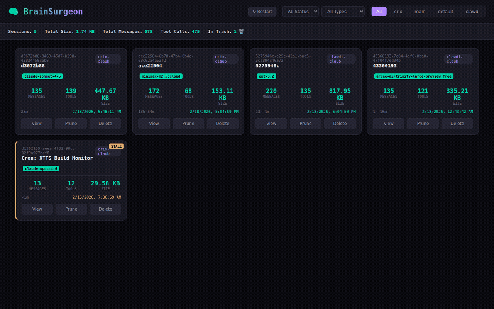

# BrainSurgeon 🧠

*OpenClaw extension for surgical session management.*

**Author:** anderslaub + friends · **[Live Demo](https://clawdi-claub.github.io/brainsurgeon/)**

A web UI to browse, view, edit, prune, and delete OpenClaw agent sessions.



---

## What is This?

Your OpenClaw agents have been busy. They've had thousands of conversations, generated terabytes of output, and somewhere in there is that one brilliant insight you need to find again.

**BrainSurgeon is your operating theater.**

Browse sessions like flipping through patient charts. Prune bloated tool outputs. Delete the experiments that didn't pan out. Edit those embarrassing 3am prompts. Your agents' memories are now yours to shape.

---

## Features

| Feature | Description |
|---------|-------------|
| 🔍 **X-Ray Vision** | Browse sessions with full metadata: tokens, models, duration, channels |
| ✂️ **Smart Pruning** | Automatically extract massive content (thinking, tool results) to separate files |
| 🗑️ **Organ Harvesting** | Delete with trash recovery — extracted files move with session |
| ✏️ **Neuroplasticity** | Edit individual messages — rewrite history if you must |
| 📊 **Vital Signs** | Token usage analytics, model breakdowns, duration tracking |
| 🔄 **Resurrection** | Restore sessions from trash (we don't judge) |
| 🧩 **Smart Collapse** | Auto-collapse long texts (>500 chars) and tool results |
| 📎 **Extraction Viewer** | Click extracted entries to view full content on-demand |



### Demo



---

## Quick Start

### Prerequisites

- OpenClaw installed and running
- Docker (recommended) or Node.js 22+
- Access to your OpenClaw data directory (usually `~/.openclaw`)

### Install as OpenClaw Extension

```bash
# Clone the repository
git clone https://github.com/clawdi-claub/brainsurgeon.git
cd brainsurgeon

# Link to OpenClaw extensions directory
ln -s "$(pwd)" ~/.openclaw/extensions/brainsurgeon
```

### Option 1: Run with Docker (Recommended)

```bash
# Build and start
docker-compose up --build -d

# Or rebuild without cache when updating
docker-compose build --no-cache
docker-compose up -d

# View logs
docker-compose logs -f
```

The UI will be available at `http://localhost:8000`

### Option 2: Run with Node.js (Development)

```bash
cd ts-api
npm install
npm run build
npm start
```

Or for development with auto-reload:
```bash
npm run dev
```

### Option 3: For AI Agents

If you are an AI assistant installing this for a human:

```bash
# Clone and prepare
git clone https://github.com/clawdi-claub/brainsurgeon.git ~/.openclaw/extensions/brainsurgeon
cd ~/.openclaw/extensions/brainsurgeon

# Deploy with Docker
exec:docker-compose up --build -d

# Verify installation
exec:curl http://localhost:8000/agents
```

---

## Configuration

### API Server

| Variable | Default | Description |
|----------|---------|-------------|
| `PORT` | `8000` | Port to run the API server |
| `AGENTS_DIR` | `/data/openclaw/agents` | Path to OpenClaw agents directory |
| `DATA_DIR` | `/data` | Path for BrainSurgeon data (bus.db, etc.) |
| `LOG_LEVEL` | `info` | Log level (debug, info, warn, error) |

### Extraction Configuration

BrainSurgeon extracts large content from session files to keep OpenClaw's context lean and fast.

**How It Works:**
- Keep the most recent `keep_recent` messages in context
- Extract everything older than that to separate files
- Extracted values are replaced with `[[extracted]]` placeholders
- Agent can restore values on-demand via the `purge_control` tool
- Skill content and important context can be protected with `_extractable` metadata

| Variable | Default | Description |
|----------|---------|-------------|
| `enabled` | `true` | Enable extraction |
| `keep_recent` | `3` | Keep this many recent messages in context |
| `min_value_length` | `500` | Only extract values longer than this (chars) |
| `trigger_types` | `tool_call,tool_result` | Message types to process for extraction |
| `scan_interval_seconds` | `30` | How often to check for extractable content |
| `retention` | `24h` | How long to keep extracted files |
| `retention_cron` | `0 */6 * * *` | Cron schedule for retention cleanup |

**Per-Message Control (`_extractable` field):**
- `true` — Force extractable (even if wrong type)
- `false` — Never extract (use for skill files you want always in context)
- `{integer}` — Keep for this many messages (overrides global `keep_recent`)

Example: Protect skill content from extraction
```json
{
  "type": "tool_result",
  "text": "# Skill: File Operations\n...",
  "_extractable": false
}
```

**Restore Mechanism:**
1. Agent calls `purge_control` with action `restore` when it needs extracted content
2. System restores the value and redacts the tool call to prevent cluttering context
3. Restored value is protected from re-extraction for `keep_recent` messages

Configure via the web UI (⚙️ Settings button) or API:
```bash
curl -X POST http://localhost:8000/api/config \
  -H "Content-Type: application/json" \
  -d '{"enabled":true,"keep_recent":3,"min_value_length":500}'
```

**⚠️ Implementation Status:** See [docs/EXTRACTION_SPEC.md](docs/EXTRACTION_SPEC.md) for full specification and current implementation gaps.

### Security

**⚠️ IMPORTANT:** By default, BrainSurgeon runs with **no authentication** (suitable for local development only). For production or shared environments, configure these security options:

| Variable | Default | Description |
|----------|---------|-------------|
| `BRAINSURGEON_API_KEYS` | *(empty)* | Comma-separated list of API keys. When set, all requests must include `X-API-Key` header. |
| `BRAINSURGEON_READONLY` | `false` | Set to `true` to disable all destructive operations (delete, edit, prune). |
| `BRAINSURGEON_CORS_ORIGINS` | `http://localhost:8000,http://127.0.0.1:8000` | Comma-separated list of allowed CORS origins. Lock this down to your domain. |

**Example with authentication:**
```bash
# Set API keys (generate strong random keys)
export BRAINSURGEON_API_KEYS="bs_live_$(openssl rand -hex 32),bs_backup_$(openssl rand -hex 32)"

# Run with Docker
docker-compose up -d

# API requests now require the key
curl -H "X-API-Key: bs_live_..." http://localhost:8000/agents
```

**Path traversal protection:** Agent names and session IDs are validated to prevent `../` attacks. Only alphanumeric characters, hyphens, and underscores are allowed.

**Rate limiting:** All endpoints have per-IP rate limits (30-60 requests per minute for most endpoints, stricter for destructive operations).

**Audit logging:** All destructive operations (delete, edit, prune, restore) are logged to stderr with action, agent, session, and truncated API key.

---

## API Endpoints

### Sessions
- `GET /api/sessions` - List all sessions
- `GET /api/sessions/:agent` - List sessions for an agent
- `GET /api/sessions/:agent/:id` - Get session details (entries annotated with `_extracted` flag)
- `GET /api/sessions/:agent/:id/entries/:entryId/extracted` - Fetch extracted content for an entry
- `POST /api/sessions/:agent/:id/prune` - Prune session (legacy)
- `POST /api/sessions/:agent/:id/prune/smart` - Smart prune with extraction
- `POST /api/sessions/:agent/:id/compact` - Trigger OpenClaw compaction
- `DELETE /api/sessions/:agent/:id` - Delete session (moves to trash, extracted files included)

### Trash
- `GET /api/trash` - List trashed sessions
- `POST /api/trash/:agent/:id/restore` - Restore session (extracted files included)
- `DELETE /api/trash/:agent/:id` - Permanently delete (extracted files removed)
- `POST /api/trash/cleanup` - Delete expired trash items

### Configuration
- `GET /api/config` - Get smart pruning config
- `POST /api/config` - Update smart pruning config
- `GET /api/config/env` - Get environment config (readonly mode, refresh interval)

### Cron
- `GET /api/cron/jobs` - List cron jobs and status
- `POST /api/cron/jobs/:name/run` - Manually trigger a job
- `POST /api/cron/reload` - Reload cron configuration
- `GET /api/cron/status` - Quick status check

### Events (OpenClaw Extension Integration)
- `POST /api/events/message-written` - Notify of new message
- `POST /api/events/session-created` - Notify of new session
- `POST /api/events/entry-restored` - Notify of restored entry

### System
- `GET /api/health` - Health check
- `GET /api/agents` - List agents
- `POST /api/restart` - Restart OpenClaw gateway

---

## Project Structure

```
brainsurgeon/
├── ts-api/                # TypeScript API server
│   ├── src/
│   │   ├── app.ts         # Main entry point
│   │   ├── domains/       # Domain modules
│   │   │   ├── config/    # Smart pruning configuration
│   │   │   ├── lock/      # File locking (OpenClaw-compatible)
│   │   │   ├── prune/     # Smart pruning + extraction
│   │   │   │   ├── cron/      # Cron service
│   │   │   │   ├── extraction/# Extraction storage + trash ops
│   │   │   │   └── trigger/   # Trigger detection
│   │   │   ├── session/   # Session management
│   │   │   └── trash/     # Trash management
│   │   ├── infrastructure/# Message bus, external storage
│   │   └── shared/        # Utilities, logging, middleware
│   ├── package.json
│   └── tsconfig.json
├── web/                   # Static web UI
│   ├── index.html
│   ├── app.js
│   └── styles.css
├── Dockerfile
├── docker-compose.yml
└── README.md
```

---

## Development

```bash
cd ts-api

# Install dependencies
npm install

# Run in development mode with auto-reload
npm run dev

# Build for production
npm run build

# Run tests
npm run test:run

# Type check
npm run typecheck
```

---

## Troubleshooting

**Sessions not showing up?**
- Check that `AGENTS_DIR` points to your actual OpenClaw agents directory
- Verify the agents directory exists: `$AGENTS_DIR/{agent}/sessions/`

**Permission denied when editing/deleting?**
- Ensure BrainSurgeon has write access to your OpenClaw directory
- When using Docker, the volume mount needs proper permissions

**UI not loading?**
- Check that the API is running: `curl http://localhost:8000/api/agents`
- Verify the port isn't already in use: `lsof -i :8000`

**Extraction not working?**
- Check smart pruning config: `curl http://localhost:8000/api/config`
- Verify `enabled: true` and `trigger_types` includes your entry types
- Check cron jobs: `curl http://localhost:8000/api/cron/jobs`

---

## GitHub Pages

The project landing page is in the `docs/` folder and deployed via GitHub Pages.

### Configuring GitHub Pages

To enable the landing page:
1. Go to repo **Settings → Pages**
2. Set **Source** to "Deploy from a branch"
3. Select **master** branch with **/docs** folder
4. Click Save

The site will deploy from `docs/index.html` with all assets referenced via relative paths.

---

## License

MIT — Do what you want, but don't blame us if you accidentally delete something important.

*"With great power comes great ability to accidentally delete things permanently."*

---

## Contributing

Issues and pull requests welcome. This is a community tool for managing OpenClaw sessions.

Built with 🧠 by anderslaub + friends
